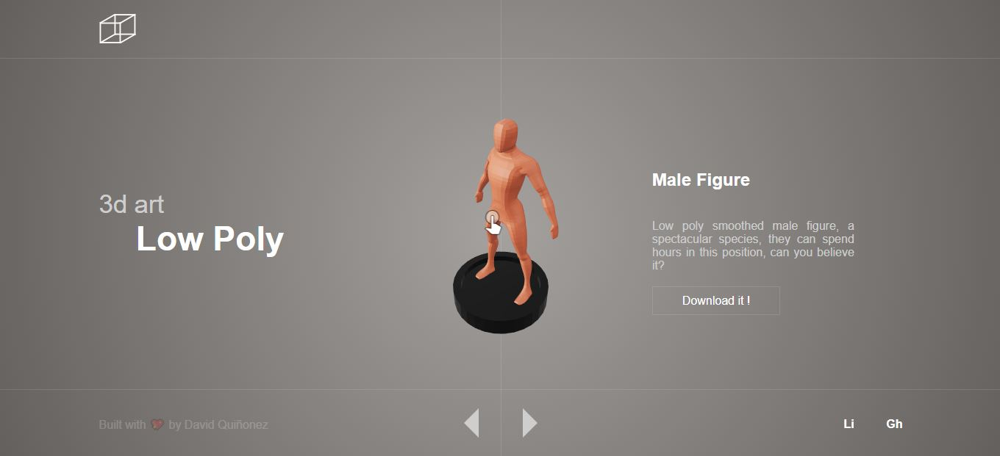

<h1 align="center">
  <br>
  
  <br>
    3d Landing
  <br>
</h1>

<h4 align="center">A simple 3d carousel page bukt with React.js</h4>

<p align="center">


<a href='https://github.com/shivamkapasia0' target="_blank"></a>
<a href='https://github.com/shivamkapasia0' target="_blank"></a>
<a href='https://github.com/shivamkapasia0' target="_blank"></a>
<a href='https://github.com/shivamkapasia0' target="_blank"></a>
<a href='https://github.com/shivamkapasia0' target="_blank"></a>
</p>

<p align="center">Badges from <a href="https://kapasia-dev-ed.my.site.com/Badges4Me/s/" target="_blank">Kapasia</a> and <a href="https://github-badges.netlify.app/" target="_blank"> Gh badges</a> </p>

<p align="center">
  <a href="#key-features">Key Features</a> •
  <a href="#how-to-use">How To Use</a> •
  <a href="#credits">Credits</a> 
</p>

<p align="center"></p>

## Key Features

- 3d models rendering on the web with react
  - Thanks to the [model-viewer](https://github.com/google/model-viewer)
- Graphql Client
  - A simple graphql client that fetch the data

## How To Use

To clone and run this application, you'll need [Git](https://git-scm.com) and [Node.js](https://nodejs.org/en/download/) (which comes with [npm](http://npmjs.com)) installed on your computer. From your command line:

```bash
# Clone this repository
$ git clone https://github.com/Dalejan/3d-landing.git

# Go into the repository
$ cd cd 3d-landing

# Install dependencies
$ npm install

# Run the app
$ npm start
```

Once the app is on you can go to `http://localhost:3000` to validate the model fetching.

> **Note**
> If you're using Linux Bash for Windows, [see this guide](https://www.howtogeek.com/261575/how-to-run-graphical-linux-desktop-applications-from-windows-10s-bash-shell/) or use `node` from the command prompt.

## Credits

This software uses the following open source packages:

- [React.js](https://react.dev/)
- [Graphql](https://graphql.org/)
- [Model-Viewer](https://github.com/google/model-viewer)
- [Sass](https://sass-lang.com/)

## You may also like...

- [3d-backend](https://github.com/Dalejan/3d-backend) - The backend that serves tthe 3d file API

---

Built with <span role="img" aria-label="heart emoji">💖</span> By David Alejandro Quiñonez

> GitHub [@Dalejan](https://github.com/Dalejan)

More social network later :D
